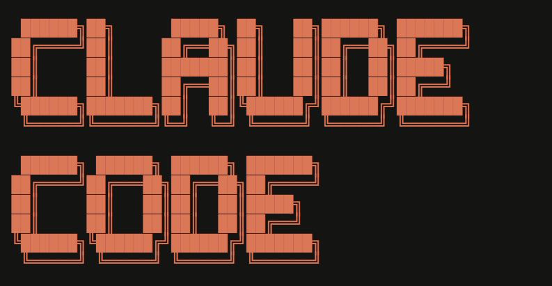

# OpenRouter Proxy for Claude Code




This project runs a small Node.js proxy server that lets tools expecting an Anthropic-style `POST /v1/messages` API talk to OpenRouter instead.

It is useful when you want to use OpenRouter models inside Claude Code or other clients that send requests in a Claude-like message format.

## What This Server Does

- Accepts requests on `POST /v1/messages`
- Reads Claude-style message payloads
- Extracts recent user messages
- Forwards them to OpenRouter's chat completions API
- Returns the response in a Claude-compatible message shape
- Supports changing the active model from chat by sending:

```text
model <model-name>
```

Example:

```text
model qwen/qwen3-next-80b-a3b-instruct:free
```

## Project Files

- `server.js` - Express server and OpenRouter proxy logic
- `package.json` - project metadata and npm scripts
- `.env` - local environment variables you create yourself
- `.env.example` - sample environment file

## Requirements

- Node.js 18 or newer
- An OpenRouter API key
- npm

## Installation

1. Clone the repository.
2. Open the project folder.
3. Install dependencies:

```bash
npm install
```

4. Create your environment file:

```bash
cp .env.example .env
```

If you are on Windows PowerShell, use:

```powershell
Copy-Item .env.example .env
```

5. Put your OpenRouter key into `.env`:

```env
OPENROUTER_API_KEY=your_openrouter_api_key_here
PORT=3000
```

## Run the Server

Start the proxy:

```bash
npm start
```

You should see logs like:

```text
Proxy running at http://localhost:3000
Default model: qwen/qwen3-next-80b-a3b-instruct:free
```

## API Endpoint

The proxy exposes:

```text
POST http://localhost:3000/v1/messages
```

## Example Request

```bash
curl -X POST http://localhost:3000/v1/messages \
  -H "Content-Type: application/json" \
  -d '{
    "messages": [
      {
        "role": "user",
        "content": [
          {
            "type": "text",
            "text": "Hello"
          }
        ]
      }
    ]
  }'
```

## Example Response

```json
{
  "id": "msg_1234567890",
  "type": "message",
  "role": "assistant",
  "content": [
    {
      "type": "text",
      "text": "Hello! How can I help you?"
    }
  ],
  "model": "qwen/qwen3-next-80b-a3b-instruct:free",
  "stop_reason": "end_turn",
  "stop_sequence": null,
  "usage": {
    "input_tokens": 0,
    "output_tokens": 0
  }
}
```

## How Model Switching Works

If the latest user message starts with `model `, the server does not call OpenRouter for a normal chat response. Instead, it updates the in-memory active model and returns a confirmation message.

Example command:

```text
model openai/gpt-4o-mini
```

Important notes:

- The selected model is stored in memory only
- Restarting the server resets it to the default model in `server.js`
- The model name must be a valid OpenRouter model ID

## How To Use With Claude Code

The exact Claude Code setup can vary depending on how you are routing requests, but the main idea is:

1. Start this proxy locally.
2. Point your Claude-compatible client or bridge to `http://localhost:3000/v1/messages`.
3. Make sure your tool sends Claude-style `messages` payloads.
4. The proxy will forward those requests to OpenRouter.

If you already have a wrapper or integration layer for Claude Code, this server is the local backend URL you plug into that flow.

## Implementation Notes

- The proxy keeps only the last 5 incoming messages
- It forwards only user-role messages to OpenRouter
- It skips known Claude internal reminder blocks
- Request body size limit is `50mb`
- The default port is `3000`, but you can override it with `PORT`

## Error Handling

The server now checks for common problems:

- Missing `OPENROUTER_API_KEY`
- OpenRouter HTTP errors
- Empty or invalid upstream responses
- Missing valid user text in the incoming payload

## Troubleshooting

### Server does not start

Check that:

- Node.js 18+ is installed
- `npm install` completed successfully
- `.env` exists
- `OPENROUTER_API_KEY` is set

### Requests fail with a 500 error

Look at the terminal logs. Common causes:

- invalid or missing OpenRouter key
- invalid model ID
- OpenRouter returned an upstream error
- request body does not match the expected message format

### Model switching does not persist

That is expected. The current model is stored only while the server process is running.

## NPM Scripts

- `npm start` - start the proxy server
- `npm run dev` - same as start
- `npm test` - syntax-check `server.js`

## Codebase Check

While reviewing the codebase, these issues were fixed:

- `package.json` incorrectly pointed to `index.js` even though the app entry file is `server.js`
- there was no proper `start` script for running the server
- the server did not clearly handle missing `OPENROUTER_API_KEY`
- upstream OpenRouter HTTP errors were not surfaced cleanly
- console output contained broken encoded characters in several messages

## Next Improvements You May Want

- move the default model into `.env`
- persist the selected model across restarts
- add request logging middleware
- add automated tests for `/v1/messages`
- support streaming responses if your client needs them

## License

ISC
